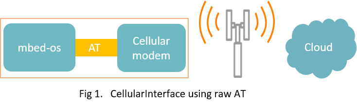
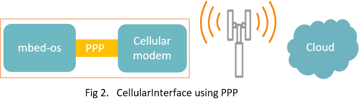
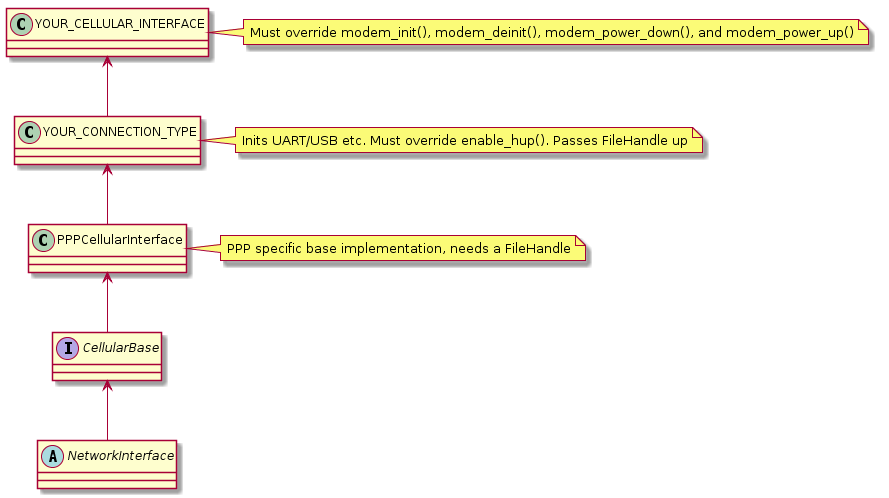

# Cellular

The [CellularBase](https://docs.mbed.com/docs/mbed-os-api/en/mbed-os-5.5/api/classCellularBase.html) provides a simple C++ API for connecting to the internet over a Cellular device.


A reference implementation of CellularBase provided by ARM mbed-os, can be found [here](https://github.com/ARMmbed/mbed-os/tree/master/features/netsocket/cellular/generic_modem_driver).

## Getting started
1. Choose an [mbed board that supports Cellular](https://developer.mbed.org/platforms/?mbed-enabled=15&connectivity=1), such as the [UBLOX-C027](https://developer.mbed.org/platforms/u-blox-C027/) or [MTS-DRAGONFLY](https://developer.mbed.org/platforms/MTS-Dragonfly/).

1. Clone [mbed-os-example-cellular](https://github.com/ARMmbed/mbed-os-example-cellular). Follow the instructions provided in the repository.

    * Compile the code

    * Flash the board
   
   You shall see output similar to the excerpt given below:
    
```

mbed-os-example-cellular, Connecting...
                                                                             
                                                                             
Connection Established.
UDP: Sent 4 Bytes to echo.u-blox.com
Received from echo server 4 Bytes
                                                            
                                                            
Success. Exiting

```

## Basic working principles
A cellular interface can be used and extended in various different ways, e.g., 

i) Using raw AT commands to drive the cellular modem (on-chip IP stacks).

<span class="images"></span>

ii) Using a PPP pipe between mbed-os supported IP stack and cellular modem device. 

<span class="images"></span>


[mbed-os-example-cellular](https://github.com/ARMmbed/mbed-os-example-cellular) utilizes [a generic modem driver](https://github.com/ARMmbed/mbed-os/tree/master/features/netsocket/cellular/generic_modem_driver) which is based upon basic design shown in Fig 2. above, i.e., 
CellularInterface using PPP. We can summarize this particular basic design as follows:


* An external IP stack (LWIP) is used instead of on-chip network stacks.
* The generic modem driver uses standard 3GPP AT 27.007 AT commands to setup the cellular modem and registers to the network.
* After registration, the driver opens up a PPP (point-to-point protocol) pipe using LWIP with the cellular modem and connects to internet. 
   


## CellularBase API

[](https://docs.mbed.com/docs/mbed-os-api/en/mbed-os-5.5/api/classCellularBase.html)

## Usage Summary

To bring up the network interface:

1. Instantiate an implementation of the CellularBase class (for example the [generic modem driver](https://github.com/hasnainvirk/mbed-os/blob/cellular_feature_br/features/cellular/TARGET_GENERIC_MODEM/generic_modem_driver/)).

1. Call the ``connect(pincode, apn)`` function with an PIN code for your SIM card and an APN for your network. 
1. Once connected,  mbed-os [network sockets](network_sockets.md) can be used as usual.

## Examples
###Connection Establishment
This example establishes connection with the cellular network using mbed-os CellularInterface.

```cpp
#include "mbed.h"
#include "OnboardCellularInterface.h"

/* SIM pin code goes here */
#define PIN_CODE    "1234"

/* Network credentials like APN go here, e.g.,
    "apn, username, password" */
#define CREDENTIALS "internet"

/* Number of retries */
#define RETRY_COUNT 3

OnboardCellularInterface iface;

nsapi_error_t do_connect()
{
    nsapi_error_t retcode;
    bool disconnected = false;
    uint8_t retry_counter = 0;

    while (!iface.is_connected()) {

        retcode = iface.connect();
        if (retcode == NSAPI_ERROR_AUTH_FAILURE) {
            printf("\n\nAuthentication Failure. Exiting application\n");
            return retcode;
        } else if (retcode != NSAPI_ERROR_OK) {
            printf("\n\nCouldn't connect: %d, will retry\n", retcode);
            retry_counter++;
            continue;
        } else if (retcode != NSAPI_ERROR_OK && retry_counter > RETRY_COUNT) {
            printf("\n\nFatal connection failure: %d\n", retcode);
            return retcode;
        }

        break;
    }

    printf("\n\nConnection Established.\n");

    return NSAPI_ERROR_OK;
}

int main()
{
    /* Set Pin code for SIM card */
    iface.set_sim_pin(PIN_CODE);

    /* Set network credentials here, e.g., APN*/
    iface.set_credentials(CREDENTIALS);

    printf("\n\nmbed-os-example-cellular, Connecting...\n");

    /* Attempt to connect to a cellular network */
    if (do_connect() == NSAPI_ERROR_OK) {
        printf("\n\nSuccess. Exiting \n\n");
        return 0;
    }

    printf("\n\nFailure. Exiting \n\n");
    return -1;
}
```

### TCP socket example
This example opens up a TCP socket with an echo server and undergoes a TCP transaction. Connection logic is exactly the same as in previous example. 
```cpp
#include "mbed.h"
#include "UDPSocket.h"
#include "OnboardCellularInterface.h"

// SIM pin code goes here
#define PIN_CODE    "1234"

// Network credentials like APN go here, e.g.,
// "apn, username, password"
#define CREDENTIALS "internet"

// Number of retries /
#define RETRY_COUNT 3

// Cellular network interface object 
OnboardCellularInterface iface;

// Echo server hostname
const char *host_name = "echo.u-blox.com";

// Echo server TCP port
const int port = 7;

/**
 * Connects to the Cellular Network
 */
nsapi_error_t do_connect()
{
    nsapi_error_t retcode;
    uint8_t retry_counter = 0;

    while (!iface.is_connected()) {

        retcode = iface.connect();
        if (retcode == NSAPI_ERROR_AUTH_FAILURE) {
            printf("\n\nAuthentication Failure. Exiting application\n");
            return retcode;
        } else if (retcode != NSAPI_ERROR_OK) {
            printf("\n\nCouldn't connect: %d, will retry\n", retcode);
            retry_counter++;
            continue;
        } else if (retcode != NSAPI_ERROR_OK && retry_counter > RETRY_COUNT) {
            printf("\n\nFatal connection failure: %d\n", retcode);
            return retcode;
        }

        break;
    }

    printf("\n\nConnection Established.\n");

    return NSAPI_ERROR_OK;
}

/**
 * Opens a TCP socket with the given echo server and undegoes an echo
 * transaction.
 */
nsapi_error_t test_send_recv()
{
    nsapi_size_or_error_t retcode;
    
    TCPSocket sock;
    
    retcode = sock.open(&iface);
    if (retcode != NSAPI_ERROR_OK) {
        printf("TCPSocket.open() fails, code: %d\n", retcode);
        return -1;
    }

    SocketAddress sock_addr;
    retcode = iface.gethostbyname(host_name, &sock_addr);
    if (retcode != NSAPI_ERROR_OK) {
        printf("Couldn't resolve remote host: %s, code: %d\n", host_name,
               retcode);
        return -1;
    }

    sock_addr.set_port(port);

    sock.set_timeout(15000);
    int n = 0;
    char *echo_string = "TEST";
    char recv_buf[4];

    retcode = sock.connect(sock_addr);
    if (retcode < 0) {
        printf("TCPSocket.connect() fails, code: %d\n", retcode);
        return -1;
    } else {
        printf("TCP: connected with %s server\n", host_name);
    }
    retcode = sock.send((void*) echo_string, sizeof(echo_string));
    if (retcode < 0) {
        printf("TCPSocket.send() fails, code: %d\n", retcode);
        return -1;
    } else {
        printf("TCP: Sent %d Bytes to %s\n", retcode, host_name);
    }

    n = sock.recv((void*) recv_buf, sizeof(recv_buf));

    sock.close();

    if (n > 0) {
        printf("Received from echo server %d Bytes\n", n);
        return 0;
    }

    return -1;

    return retcode;
}

int main()
{
    iface.modem_debug_on(MBED_CONF_APP_MODEM_TRACE);
    /* Set Pin code for SIM card */
    iface.set_sim_pin(PIN_CODE);

    /* Set network credentials here, e.g., APN*/
    iface.set_credentials(CREDENTIALS);

    printf("\n\nmbed-os-example-cellular, Connecting...\n");

    /* Attempt to connect to a cellular network */
    if (do_connect() == NSAPI_ERROR_OK) {
        nsapi_error_t retcode = test_send_recv();
        if (retcode == NSAPI_ERROR_OK) {
            printf("\n\nSuccess. Exiting \n\n");
            return 0;
        }
    }

    printf("\n\nFailure. Exiting \n\n");
    return -1;
}
// EOF
```

## Porting Guide
This section  provides guidelines and details for porting a cellular device driver to mbed-os. It first puts forward a bird eye view of the
system under the hood which knits everything togather for your new cellular interface and then it sheds light on the whole process 
of porting step by step.

###Quick Peak
A cellular network interface can be implemented in different flavours based upon requirements and physical setup. For example:

1. **Case 1: An implementation using mbed-os provided network stacks (PPP mode)**
	* Pros
		* A full fledge, well established network stack with full mbed-os support
		* Simple operation and implementation as all socket APIs are provided  by the inherent network stack.
		* Needs less maintainance as bulk of the work is handled by the IP stack in data-mode. Command mode is turned off as soon as device enters in data-mode.
	* Cons
		* Heavy memory consumption 
		* Multiplexing command-mode and data-mode is not yet available
		* Bigger footprint on flash
		  
 2. **Case 2: An implementation using on-chip network stacks (AT only mode)**
	
	* Pros
		* Lighter memory footprint
		* Lighter flash footprint
	* Cons
		* Subtle variations of different on-chip network stacks make maintainance difficult
		* Limited capabilities in some instances
		* Variations in AT command set (sometimes custom) implementations make it difficult to anticipate the behaviour of overall system
		* Needs implementation of an abstraction layer over AT-sockets to glue them togather with standard mbed-os sockets 

3. **Case 3: Modem present on target borad**
 	* This refers to the case when the cellular modem is bundled with the target board.
 	* Target board must provide an implementation of [onboard_modem_api](https://github.com/ARMmbed/mbed-os/blob/master/features/netsocket/cellular/onboard_modem_api.h). For example, target port for Ublox C027 mbed enabled IoT starter kit provides an implementation of `onboard_modem_api` [here](https://github.com/ARMmbed/mbed-os/blob/master/targets/TARGET_NXP/TARGET_LPC176X/TARGET_UBLOX_C027/onboard_modem_api.c).
 	* Following mbed-os conventions, drivers for on-board modules may become part of mbed-os tree. 
 	
4. **Case 4: Modem attached as a daughter board (Arduino shield)**
	* This refers to the case when the cellular modem comes as a plug-in moddule or an external shield (e.g., with an arduino form factor).
	* Following mbed-os conventions, drivers for plug-in modules come as a library with an application, i.e., they are not part of mbed-os tree. 
	* If the port inherits from ARM mbed-os provided (generic modem driver), the structure might look like this:	
	<span class="images"></span>
	 

No matter what is your flavour of choice, mbed-os provides ample framework for both. Common infrastructure shared between 
above-mentioned flavours can be listed as:

**a) Onboard modem API**

> Only valid for onboard modem types, i.e, **Case 3** is applicable. A hardware abstraction layer between a cellular modem and an mbed-os cellular driver. This API provides basic framework for initializing/de-initializing hardware as well as turning the modem on or off etc. For example:

```C
/** Sets the modem up for powering on
 *  modem_init() will be equivalent to plugging in the device, i.e.,
 *  attaching power or serial port.
 *  Layout of modem_t is implementation dependent
 */
void modem_init(modem_t *obj);
```

**b) A device type file handle **

> A device type file handle. This makes a cellular interface implementation independent of underlying physical interface between the cellular modem and MCU, for example Serial UART, USB etc. 
``` CPP
FileHandle _fh;
```

> In case of a UART type of device, mbed-os provides an implementation of serial device type FileHandle with software buffering.
```CPP
FileHandle * _fh = new UARTSerial(TX_PIN, RX_PIN, BAUDRATE);
```
**c) An AT command parser**
> An AT command parser that takes in a file handle and subsequently reads and writes to the user provided file handle.  
```CPP
ATCmdParser *_at = new ATCmdParser(_fh);
```

**d) Polling mechanism for file handles**
> A mechanism to multiplex input/output over a set of file handles(file descriptors).
 For every file handle provided, poll() examines it for any events registered for that particular file handle.

```CPP
/**
* Where fhs is an array of pollfh structs carrying FileHandle(s) and bit mask of events.
* nhfs is the number of file handles.
* timout is the amount of time to block poll, i.e., waiting for an event
*/
int poll(pollfh fhs[], unsigned nfhs, int timeout);
```

**e) PPP abstraction layer for network stacks**
> Only valid when **Case 1** is applicable. This abstraction layer provides an entry point for cellular drivers to underlying PPP framework provided by the network stack. This in effect means that the driver itself does not depend upon a 
certain network stack, i.e., it will talk to any network stack providing this standard PPP interface. For example:

```CPP
/** Connect to a PPP pipe
 *
 *  @param stream       Pointer to a device type file handle (descriptor)
 *  @param status_cb    Optional, user provided callback for connection status
 *  @param uname        Optional, username for the connection
 *  @param pwd          Optional, password for the connection
 *
 *  @return             0 on success, negative error code on failure
 */
nsapi_error_t nsapi_ppp_connect(FileHandle *stream, Callback<void(nsapi_error_t)> status_cb=0, const char *uname=0, const char *pwd=0);
```   
### Step-by-step Porting Process
#### Providing onboard modem API
Only valid where **Case 3** is applicable. 

- **Update _mbed-os/targets/targets.json_** 
This file defines all the target platforms supported by mbed-os. If your specific target was supported by mbed-os, you will find an entry for your target in this file. Define a global macro in your target description that tells the build system that your target have a modem and the data connection type is attached with MCU.

For example,

```json
    "MY_TARGET_007": {
        "supported_form_factors": ["ARDUINO"],
        "core": "Cortex-M3",
        "supported_toolchains": ["ARM", "uARM", "GCC_ARM", "GCC_CR", "IAR"],
        "extra_labels": ["LABEL", "ANOTHER_LABEL"],
        "config": {
            "modem_is_on_board": {
                "help": "Value: Tells the build system that the modem is on-board as oppose to a plug-in shield/module.",
                "value": 1,
                "macro_name": "MODEM_ON_BOARD" 
            },
            "modem_data_connection_type": {
                "help": "Value: Defines how the modem is wired up to the MCU, e.g., data connection can be a UART or USB and so forth.",
                "value": 1,
                "macro_name": "MODEM_ON_BOARD_UART" 
            }
        },
        "macros": ["TARGET_007"],
        "inherits": ["TargetBond"],
        "device_has": ["ETHERNET", "SPI"],
        "device_name": "JamesBond"
    },
```
- ** Try to Use standard pin names** 
A standard naming conventions for pin names is highly appreciated for standard modem pins in your target's 
**_'targets/TARGET_FAMILY/YOUR_TARGET/PinNames.h'_**.
An example is shown below for full UART capable modem. If any of these pins is not connected physically, do mark it **_'NC'_**.
Also mark pin polarity. 
```C
typedef enum {

	MDMTXD = P0_15, // Transmit Data
	MDMRXD = P0_16, // Receive Data
	MDMCTS = P0_17, // Clear to Send
	MDMDCD = P0_18, // Data Carrier Detect
	MDMDSR = P0_19, // Data Set Ready
	MDMDTR = P0_20, // Data Terminal Ready (set high or use handshake)
	MDMRI  = P0_21, // Ring Indicator
	MDMRTS = P0_22, // Request to Send (set high or use handshake)
	
} PinName;

#define ACTIVE_HIGH_POLARITY    1
#define ACTIVE_LOW_POLARITY     0

#define MDM_PIN_POLARITY            ACTIVE_HIGH_POLARITY

```

- **Implement onboard_modem_api.h**

Provide an implementation of `onboard_modem_api.h`.
An example implementation can be found [here](https://github.com/ARMmbed/mbed-os/blob/master/targets/TARGET_NXP/TARGET_LPC176X/TARGET_UBLOX_C027/onboard_modem_api.c).

[](https://docs.mbed.com/docs/mbed-os-api/en/mbed-os-5.5/api/onboard_modem_api.html)

#### 