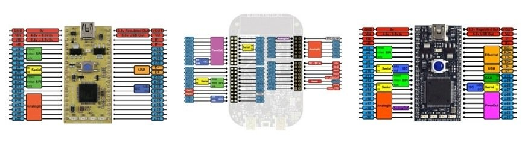

#BusIn

You use the BusIn interface to read a single value from several DigitalIn pins. You can use any of the numbered pins on your board for this.

BusIn is an abstraction that takes any pins and makes them appear as though they are linearly memory mapped for ease of use.  You can then check multiple inputs in a single pass. In general, this abstraction makes your code less cluttered, clearer,  and faster to write.

**Tip:** Please pay attention to the ordering of pins in the initialization. The order pins are initialized in are the reverse order that bits are OR'd together.

## Hello World!

Combine four pins into a single BusIn.

 

## API

 

## Interface

The BusIn Interface can use any pin with a blue label, as shown in these pinouts:

Pinouts showing the numbered pins with blue labels

